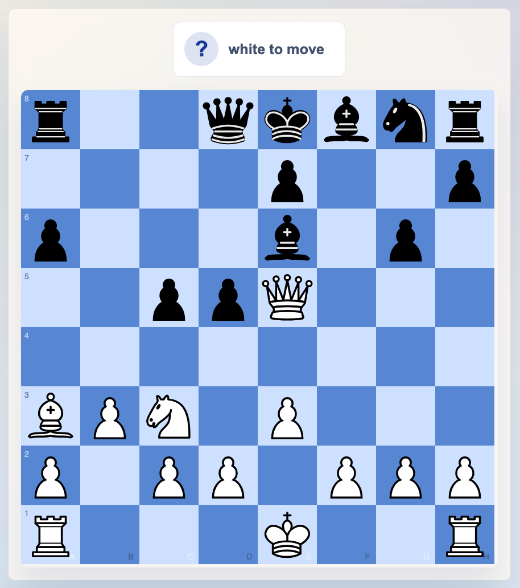

# Atomic Puzzles

Atomic Puzzles is a React + Vite web app for the Lichess atomic chess community. It combines a tactics trainer with rankings, recent-match tracking, player profiles, head-to-head pages, and tournament archives in one place.

Live site: [atomicpuzzles.org](https://atomicpuzzles.org)



## Table of Contents

- [Why this project exists](#why-this-project-exists)
- [Features](#features)
- [Tech stack](#tech-stack)
- [Getting started](#getting-started)
- [Supabase data model](#supabase-data-model)
- [Available scripts](#available-scripts)
- [Project structure](#project-structure)
- [Deployment notes](#deployment-notes)
- [Contributing](#contributing)
- [License](#license)

## Why this project exists

Atomic chess has a strong community, but the tools around it are usually fragmented. This project brings several useful workflows together:

- Solve atomic puzzles from a shared puzzle library.
- Track first-attempt puzzle progress for logged-in users.
- Browse monthly player rankings by time control.
- Explore player profiles, aliases, bans, and match history.
- Compare two players head to head.
- Review recent results across multiple time controls.
- Browse Atomic World Championship bracket pages and archives.

## Features

### Puzzle training

- Interactive atomic chess board powered by Chessground.
- Puzzle solving with main-line and variation support.
- Random puzzle loading and direct links like `/solve/:puzzleId`.
- Keyboard move navigation and solution review.
- Lichess analysis links for the current position.
- Per-user progress tracking for first attempts and correctness.

### Community data

- Monthly rankings for blitz, bullet, and hyperbullet.
- Player pages with alias resolution and rating history.
- Recent match browsing with filters and per-match pages.
- Head-to-head comparison pages.
- Full tracked-user directory plus banned-player view.
- Tournament archive pages for Atomic World Championship events.

### Product details

- Lichess OAuth login using PKCE.
- Supabase-backed data access.
- Client-side routing with deep-link support.
- SEO metadata for major pages.
- Theme and board customization stored locally.

## Tech stack

- [React 18](https://react.dev/)
- [Vite](https://vitejs.dev/)
- [TanStack Router](https://tanstack.com/router)
- [Supabase JavaScript client](https://supabase.com/docs/reference/javascript/introduction)
- [@lichess-org/chessground](https://www.npmjs.com/package/@lichess-org/chessground)
- [chessops](https://github.com/niklasf/chessops)
- ESLint
- Prettier

## Getting started

```bash
npm install
npm run dev
```

The dev server will print a local URL, usually `http://localhost:5173`.

## Supabase data model

This app assumes Supabase already contains community data. It is a frontend for an existing dataset, not a schema-migration project.

### Minimum puzzle row shape

The puzzle loader expects rows similar to:

```json
{
  "id": "123",
  "fen": "rnbqkbnr/pppppppp/8/8/8/8/PPPPPPPP/RNBQKBNR w KQkq - 0 1",
  "solution": "e4 e5 Qh5"
}
```

At minimum:

- `id` must be stable and unique.
- `fen` must be a valid atomic-compatible position string.
- `solution` must contain a non-empty move line.

### Tables and functions used by the app

Depending on which pages you open, the frontend reads from or writes to:

- `puzzles`
- `users`
- `lb`
- `puzzle_progress`
- additional community tables referenced by profile, rating, alias, match, and tournament pages

Puzzle progress also uses these RPCs by default:

- `record_first_puzzle_attempt`
- `get_puzzle_progress_page`
- `get_attempted_puzzle_ids`

### Constraints worth having

For production safety, the data layer should enforce idempotency and uniqueness where appropriate. In practice, these constraints are especially helpful:

- `users.username` unique
- `(puzzle_progress.username, puzzle_progress.puzzle_id)` unique

Without those constraints, concurrent writes from multiple tabs or devices are harder to keep consistent.

## Available scripts

```bash
npm run dev
npm run build
npm run preview
npm run lint
npm run lint:fix
npm run format
npm run format:write
```

## Project structure

```text
.
├── public/                    # Static assets, icons, redirects, puzzle images
├── src/
│   ├── App/                   # App shell
│   ├── components/            # Shared UI components
│   ├── context/               # Auth and app settings providers
│   ├── hooks/                 # Data and UI hooks
│   ├── lib/                   # Supabase, auth, puzzle, and tournament logic
│   ├── pages/                 # Route-level pages
│   ├── theme/                 # Chessground theme styles
│   └── utils/                 # Formatting, routing, transforms, caching helpers
├── index.html
├── vite.config.js
└── README.md
```

## Deployment notes

The app is set up like a standard static SPA build:

- Build command: `npm run build`
- Output directory: `dist`

Netlify deep-link support is handled through [`public/_redirects`](public/_redirects):

```text
/*    /index.html   200
```

That keeps routes such as `/solve/12` and `/@/username` working on refresh.

## Contributing

Contributions are welcome, especially around:

- puzzle UX and training flow
- accessibility
- mobile polish
- data loading performance
- ranking and profile exploration features
- tournament archive presentation

If you plan to contribute:

1. Install dependencies with `npm install`.
2. Run `npm run dev`.
3. Run `npm run lint` and `npm run format` before opening a PR.

The repository currently does not include an automated test suite, so manual verification is important for route changes, puzzle solving, auth flow, and Supabase-backed pages.

## License

A license file is not currently included in this repository. Until one is added, assume the code is not available for unrestricted reuse.
