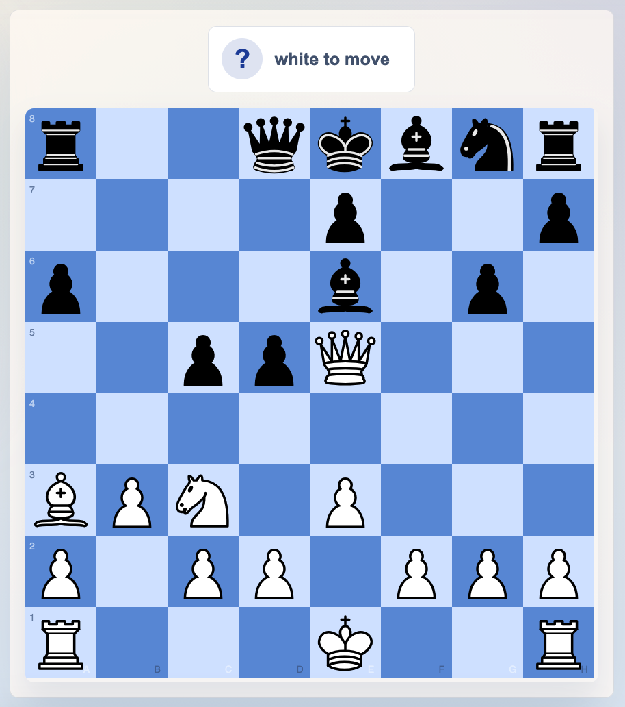

# Atomic Puzzles

Atomic Puzzles is a React + Vite web app for the Lichess atomic chess community. It combines a tactics trainer with rankings, recent-match tracking, player profiles, head-to-head pages, and tournament archives in one place.

Live site: [atomicpuzzles.org](https://atomicpuzzles.org)



## Table of Contents

- [Why this project exists](#why-this-project-exists)
- [Features](#features)
- [Tech stack](#tech-stack)
- [Getting started](#getting-started)
- [Data services](#data-services)
- [Available scripts](#available-scripts)
- [Project structure](#project-structure)
- [Deployment notes](#deployment-notes)
- [Contributing](#contributing)
- [License](#license)

## Why this project exists

Atomic chess has a strong community, but the tools around it are usually fragmented. This project brings several useful workflows together:

- Solve atomic puzzles from a shared puzzle library.
- Track first-attempt puzzle progress for logged-in users.
- Browse monthly player rankings by time control.
- Explore player profiles, aliases, bans, and match history.
- Compare two players head to head.
- Review recent results across multiple time controls.
- Browse Atomic World Championship bracket pages and archives.

## Features

### Puzzle training

- Interactive atomic chess board powered by Chessground.
- Puzzle solving with main-line and variation support.
- Random puzzle loading and direct links like `/solve/:puzzleId`.
- Keyboard move navigation and solution review.
- Lichess analysis links for the current position.
- Per-user progress tracking for first attempts and correctness.

### Community data

- Monthly rankings for blitz, bullet, and hyperbullet.
- Player pages with alias resolution and rating history.
- Recent match browsing with filters and per-match pages.
- Head-to-head comparison pages.
- Full tracked-user directory plus banned-player view.
- Tournament archive pages for Atomic World Championship events.

### Product details

- Lichess OAuth login using PKCE.
- Server-only Turso archive access through Netlify Functions.
- Supabase-backed authentication and mutable puzzle/community data.
- Client-side routing with deep-link support.
- SEO metadata for major pages.
- Theme and board customization stored locally.

## Tech stack

- [React 18](https://react.dev/)
- [Vite](https://vitejs.dev/)
- [TanStack Router](https://tanstack.com/router)
- [Turso/libSQL](https://docs.turso.tech/sdk/ts/quickstart)
- [Supabase JavaScript client](https://supabase.com/docs/reference/javascript/introduction)
- [@lichess-org/chessground](https://www.npmjs.com/package/@lichess-org/chessground)
- [chessops](https://github.com/niklasf/chessops)
- ESLint
- Prettier

## Getting started

```bash
npm install
npm run dev
```

The dev server will print a local URL, usually `http://localhost:5173`.

## Data services

### Supabase mutable data

Supabase stores authentication-related records and mutable puzzle/community data. This app is a
frontend for an existing dataset, not a schema-migration project.

### Minimum puzzle row shape

The puzzle loader expects rows similar to:

```json
{
  "id": "123",
  "fen": "rnbqkbnr/pppppppp/8/8/8/8/PPPPPPPP/RNBQKBNR w KQkq - 0 1",
  "solution": "e4 e5 Qh5"
}
```

At minimum:

- `id` must be stable and unique.
- `fen` must be a valid atomic-compatible position string.
- `solution` must contain a non-empty move line.

### Tables and functions used by the app

Depending on which pages you open, the frontend reads from or writes to:

- `puzzles`
- `users`
- `puzzle_progress`
- additional mutable community tables referenced by puzzle, profile, and tournament pages

Historical matches, aliases, ratings, and leaderboards are not read from Supabase. Those reads go
through the server-only Turso archive API described below.

### Turso archive data

Turso stores the complete read-only match archive, normalized aliases, rating history, and
leaderboard history. Browser code accesses it only through `/api/archive-data`; direct client-side
database connections are prohibited.

The normalized archive schema uses `players` and `time_controls` as lookup tables. `aliases`,
`matches`, `player_ratings`, and `lb` reference player IDs; `matches` also references a time-control
ID. The database intentionally has no declared foreign-key constraints, so readers must preserve
those logical joins.

Archive mode IDs are `0` hyperbullet, `1` bullet, `2` blitz, `3` wolfrandom, and `4` atomic960.
Match source IDs are `0` lobby, `1` arena, `2` friend, `3` swiss, `4` Chess.com, and `5`
unknown/other. Ratings and RDs are stored at ten times their display value and are scaled back in
the Netlify function. The function also expands the pipe-separated compact `matches.games` value
into an array before returning it to the browser.

Puzzle progress also uses these RPCs by default:

- `record_first_puzzle_attempt`
- `get_puzzle_progress_page`
- `get_attempted_puzzle_ids`

### Constraints worth having

For production safety, the data layer should enforce idempotency and uniqueness where appropriate. In practice, these constraints are especially helpful:

- `users.username` unique
- `(puzzle_progress.username, puzzle_progress.puzzle_id)` unique

Without those constraints, concurrent writes from multiple tabs or devices are harder to keep consistent.

## Available scripts

```bash
npm run dev
npm run build
npm run preview
npm run lint
npm run lint:fix
npm run format
npm run format:write
```

## Project structure

```text
.
├── public/                    # Static assets, icons, redirects, puzzle images
├── netlify/
│   ├── archive/               # Server-only Turso client and archive queries
│   ├── features/              # Mutable server-side application features
│   └── functions/             # Thin Netlify function entry points
├── src/
│   ├── App/                   # App shell
│   ├── components/            # Shared UI components
│   ├── context/               # Auth and app settings providers
│   ├── hooks/                 # Data and UI hooks
│   ├── lib/
│   │   ├── archive/           # Browser archive API modules and response types
│   │   ├── matches/           # Match parsing, filters, routes, and queries
│   │   ├── supabase/          # Mutable Supabase client, readers, and data types
│   │   └── users/             # Username, alias, and recent-user logic
│   ├── pages/                 # Route-level pages
│   ├── theme/                 # Chessground theme styles
│   └── utils/                 # Cross-domain formatting and utility helpers
├── index.html
├── vite.config.js
└── README.md
```

## Deployment notes

The app is set up like a standard static SPA build:

- Build command: `npm run build`
- Output directory: `dist`

The production opening explorer uses a Netlify Function backed by Turso. Configure these
environment variables in Netlify:

- `TURSO_DATABASE_URL`, from `turso db show --url openings2`
- `TURSO_AUTH_TOKEN`, from `turso db tokens create openings2 --read-only`

The complete match, alias, rating, and leaderboard archive uses a separate Turso database. Configure:

- `TURSO_MATCHES_DATABASE_URL`, from `turso db show matches --url`
- `TURSO_MATCHES_AUTH_TOKEN`, from `turso db tokens create matches --read-only`

The browser reads this database only through `/api/archive-data`; the token must never use a
`VITE_` prefix or be exposed to client code. Supabase remains responsible for Auth and mutable
community data.

Authenticated community actions use a signed, 30-day first-party session cookie. Configure:

- `SITE_SESSION_SECRET`, a random secret of at least 32 characters (for example,
  `openssl rand -base64 48`)
- `SITE_SESSION_PREVIOUS_SECRETS`, optional comma-separated prior secrets during key rotation

If `SITE_SESSION_SECRET` is temporarily absent, the server falls back to the existing Supabase
service-role key so deployments remain compatible, but a dedicated secret is recommended.

Netlify deep-link support is handled through [`public/_redirects`](public/_redirects):

```text
/api/opening-explorer/health    /.netlify/functions/opening-explorer    200
/api/opening-explorer    /.netlify/functions/opening-explorer    200
/api/archive-data    /.netlify/functions/archive-data    200
/*    /index.html   200
```

That keeps routes such as `/solve/12` and `/@/username` working on refresh.

## Contributing

Contributions are welcome, especially around:

- puzzle UX and training flow
- accessibility
- mobile polish
- data loading performance
- ranking and profile exploration features
- tournament archive presentation

If you plan to contribute:

1. Install dependencies with `npm install`.
2. Run `npm run dev`.
3. Run `npm run lint` and `npm run format` before opening a PR.

Run `npm test` for the automated suite. Manual verification remains useful for visual route
changes, puzzle solving, and production OAuth redirects.

## License

This project is licensed under the GNU General Public License v3.0 or later (`GPL-3.0-or-later`). See
[LICENSE](LICENSE) for the full text.
